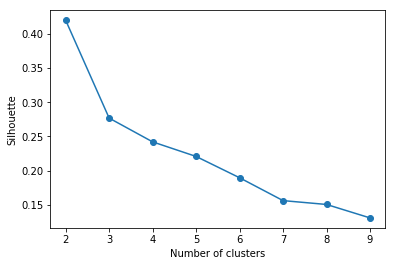
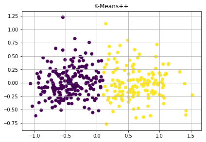

# K-Means
## The best value of k

We choose k as 2 because this value of k have the best silhouette coefficient

## Execute K-Means

The initial centroids are random points. We take the best value of k, that we calculate before.
We can see in the image that we have two different clusters: Temperature and Precipitation

