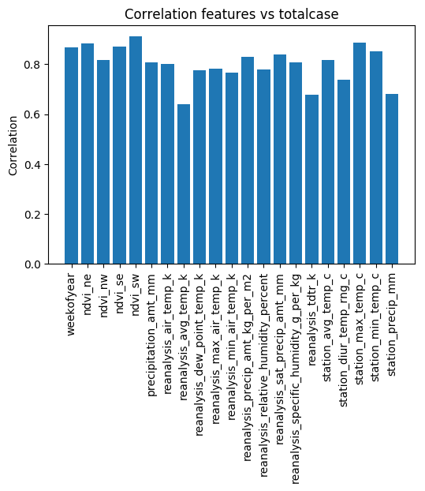
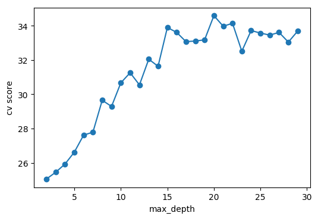
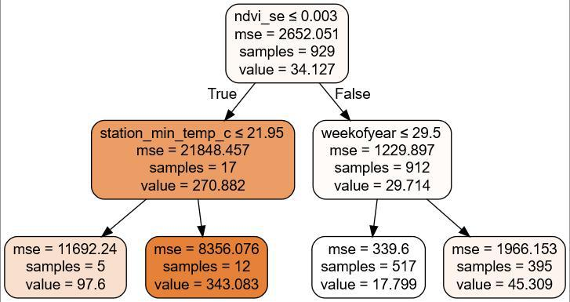
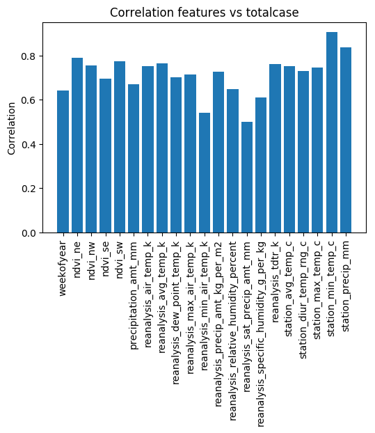
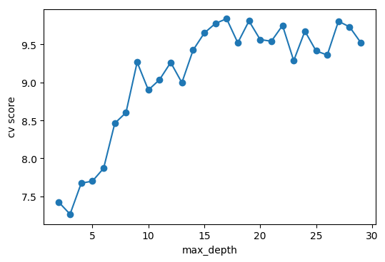
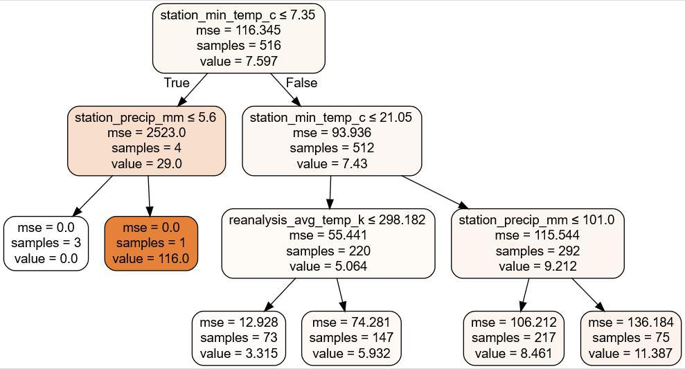

# Feature Engineering

## Load Data

In this activity we use all the data set for the first time, we separate the data of different cities.

# San Juan

## Correlation 

We extract the correlation between each feature and label (total_cases).

The next thing is to select the features with the most correlation (R>0.85):

|  |  |
| -- | -- |
| __Feature__ | __R value__ |
| weekofyear | 0.868854 |
| ndvi_ne |  0.884373 |
| ndvi_se | 0.872128 |
| ndvi_sw |  0.911289 |
| station_max_temp_c | 0.886403 |
| station_min_temp_c | 0.850485 |

## Cross Validation

We need to select the best maximun depth, that's why we will execute a loop that creates a decision tree with each value between 2 and 30.

The best maximun depth is 2.

## Build the model

We create the regression model with the MSE (Mean Squared Error) criterion and the best maximun depth.

### Decision Tree

### Features Relevances

|  |  |
| -- | -- |
| __Feature__ | __Relevance__ |
| weekofyear | 0.125267 |
| ndvi_ne |  0 |
| ndvi_se | 0.717514 |
| ndvi_sw |  0 |
| station_max_temp_c | 0 |
| station_min_temp_c | 0.15722 |

Features with more relevance: ['ndvi_se', 'station_min_temp_c']

# Iquitos

## Correlation 

We extract the correlation between each feature and label (total_cases).

The next thing is to select the features with the most correlation (R>0.76):

|  |  |
| -- | -- |
| __Feature__ | __R value__ |
| ndvi_ne | 0.789115 |
| ndvi_sw |  0.775314 |
| reanalysis_avg_temp_k | 0.764052 |
| reanalysis_tdtr_k |  0.762234 |
| station_min_temp_c | 0.905283 |
| station_precip_mm | 0.837833 |

## Cross Validation

We need to select the best maximun depth, that's why we will execute a loop that creates a decision tree with each value between 2 and 30.

The best maximun depth is 3.

## Build the model

We create the regression model with the MSE (Mean Squared Error) criterion and the best maximun depth.

### Decision Tree

### Features Relevances

|  |  |
| -- | -- |
| __Feature__ | __Relevance__ |
| ndvi_ne | 0 |
| ndvi_sw |  0 |
| reanalysis_avg_temp_k | 0.0224044 |
| reanalysis_tdtr_k |  0. |
| station_min_temp_c | 0.268704 |
| station_precip_mm | 0.708892 |

Features with more relevance: ['station_precip_mm', 'station_min_temp_c']
